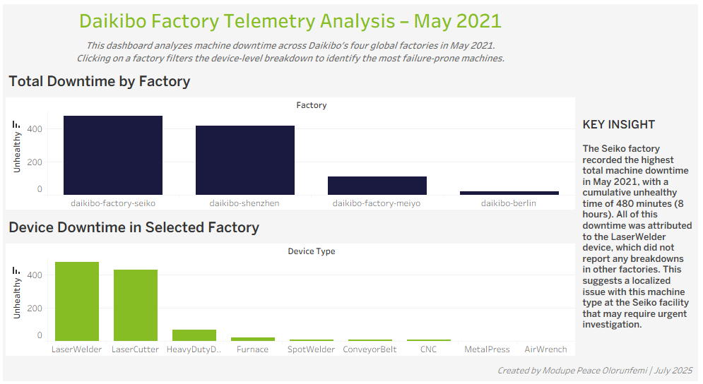
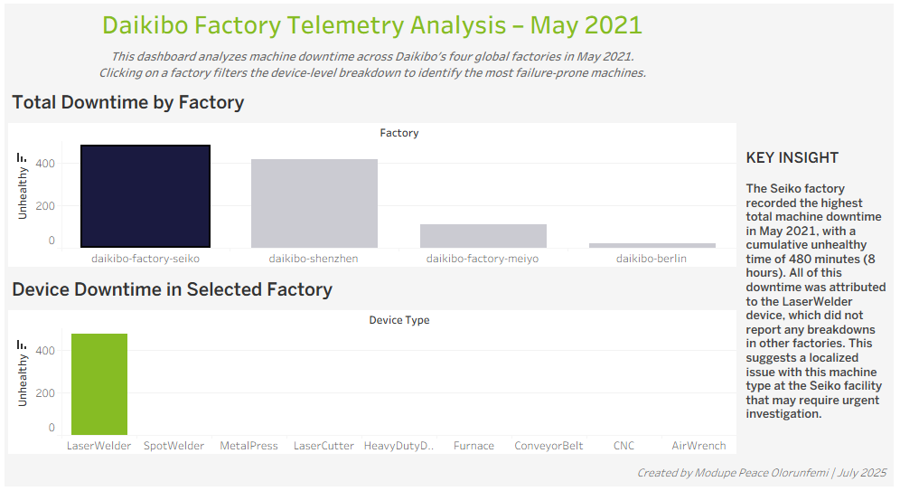
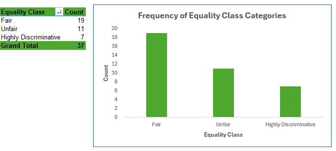

# Factory-Downtime-and-Gender-Pay-Equality-Analysis
### Deloitte Data Analytics Virtual Experience (Forage) Project

## Project Overview
This project was completed as part of the Deloitte Data Analytics Virtual Experience Program on Forage.
The project focuses on analyzing operational and workforce data from Daikibo Industrials to generate insights that support business decision-making.
The analysis was divided into two tasks:
- Machine Downtime Analysis using Tableau
- Gender Pay Equality Analysis using Microsoft Excel
The project demonstrates how data analytics can be applied to identify operational inefficiencies and potential workplace inequalities.

**NOTE**: The dataset used in this project is simulated and provided for educational purposes.

## Business Problem
Daikibo Industrials operates several manufacturing factories globally. The company collects telemetry data from machines across its facilities to monitor operational performance.
The organization also received internal complaints regarding potential gender pay inequality across job roles.
The goal of this project was to analyze these datasets and answer key business questions.

## Project Workflow
The analysis followed a structured data analytics workflow:
- **Data Collection**: Imported telemetry and equality datasets provided in the simulation.
- **Data Preparation**: Cleaned and structured the datasets for analysis in Tableau and Excel.
- **Data Analysis**: Created calculated fields, classifications, and pivot summaries to uncover patterns.
- **Data Visualization**: Built interactive dashboards and charts to communicate findings clearly.
- **Insight Generation**: Interpreted the results to identify operational inefficiencies and pay equality patterns.

## Task 1 – Factory Machine Downtime Analysis
### Objective
Analyze telemetry data to determine:
- Which factory experienced the highest machine downtime.
- Which machine type contributed the most downtime in that factory.

### Dataset
Telemetry data was collected from four Daikibo factories:
- Meiyo Factory – Tokyo, Japan
- Seiko Factory – Osaka, Japan
- Berlin Factory – Germany
- Shenzhen Factory – China
Each factory operates nine different machine types.
Machines send a status message every 10 minutes, and the dataset covers May 2021.

### Data Preparation
The dataset was imported into Tableau.
A calculated field called Unhealthy was created to measure machine downtime.
Logic used:
- Each telemetry message represents 10 minutes
- If machine status = Unhealthy, assign 10 minutes of downtime
- If machine status = Healthy, assign 0 minutes
This allowed total downtime to be calculated across factories and machine types.

### Data Visualization - Dashboard
Two visualizations were created:
1. Total DownTime per Factory: A bar chart comparing total downtime across factory locations.
2. Total DownTime per Device Type: A bar chart showing downtime by machine type.
Both visualizations were combined into an interactive dashboard, where selecting a factory filters the machine-level breakdown.





[View the Interactive Tableau Dashboard](https://public.tableau.com/app/profile/olorunfemi.modupe.peace/viz/DaikiboDowntimeDashboard/-DaikiboDowntimeDashboard-?publish=yes)

### Key Insight
The analysis revealed that Daikibo Factory Seiko (Osaka, Japan) recorded the highest machine downtime during May 2021, totaling 480 minutes (8 hours).
The downtime was primarily caused by the LaserWelder machine, which did not show similar failure patterns in the other factory locations.
This indicates that the issue may be specific to the Seiko factory, rather than a system-wide issue affecting all Daikibo facilities.

### Operational Risk Insight
The concentration of downtime in a single machine type (LaserWelder) may represent an operational risk if production processes depend heavily on this device.
If the LaserWelder plays a critical role in the manufacturing workflow, repeated failures could lead to production delays, reduced efficiency, and potential financial losses.
Identifying and resolving this issue early allows the organization to implement preventive maintenance strategies and risk mitigation measures.

### Business Recommendations
Based on the analysis, the following actions are recommended:
- Investigate the LaserWelder machine at the Seiko factory to determine the root cause of repeated failures.
- Conduct preventive maintenance inspections for the affected machine type.
- Compare operating conditions across factories to identify environmental or operational differences.
- Implement continuous machine performance monitoring dashboards.

## Task 2 – Gender Pay Equality Analysis
### Objective
Analyze employee compensation data to identify potential gender pay inequality across job roles and factory locations.

### Dataset
The dataset includes the following columns:
- Factory
- Job Role
- Equality Score
The Equality Score ranges from -100 to +100, where 0 indicates perfect equality.

### Data Processing
A new column called Equality Class was created to categorize equality scores.
The following Excel formula was used:
```
=IF(ABS(C2)<=10,"Fair",IF(ABS(C2)<=20,"Unfair","Highly Discriminative"))
```

| Equality Score         | Category              |
| ---------------------- | --------------------- |
| -10 to +10             | Fair                  |
| -20 to -11 or 11 to 20 | Unfair                |
| < -20 or > 20          | Highly Discriminative |

### Data Visualization
To improve data interpretation:
1. Conditional formatting was applied
2. Categories were color coded:
- Blue – Fair
- Orange – Unfair
- Red – Highly Discriminative
A Pivot Table and Pivot Chart were created to visualize the distribution of equality classifications.



[View the Excel Analysis File](https://1drv.ms/x/c/b81fd396c97d9651/IQCX05xgKCPfQpvDX_J6wzvNAWXnHQOhXkRmBhtQ__1nd6A?e=F9deTp)

### Key Insight
The analysis shows that most job roles fall into the Fair category, indicating reasonable pay balance.
However, several roles fall into Unfair and Highly Discriminative categories, highlighting areas where compensation policies may require further review.

### Business Recommendation
Based on the equality analysis, the organization should review compensation policies for roles classified as Unfair or Highly Discriminative.
Conducting periodic gender pay audits, implementing transparent salary structures, and analyzing compensation across departments can help ensure fair pay practices and strengthen organizational trust.

## Tools and Technologies
- Tableau
- Microsoft Excel
- Data Visualization
- Pivot Tables
- Calculated Fields
- Conditional Formatting

## Business Impact
The insights from this analysis can support Daikibo Industrials in improving both operational efficiency and workplace fairness.
From an operational perspective, identifying the Seiko factory as the location with the highest downtime highlights a clear opportunity for targeted maintenance improvements. Addressing the LaserWelder issue could reduce machine downtime, improve productivity, and prevent potential manufacturing delays.
From a workforce perspective, the gender equality analysis provides an initial overview of potential pay imbalance across job roles. Identifying roles that fall into the Unfair or Highly Discriminative categories allows leadership to investigate compensation policies and ensure fair pay practices.
Together, these insights demonstrate how data analysis can support both operational performance and organizational accountability.

## Next Steps
Further analysis could expand this project in several ways:
- Time-based analysis of machine failures to detect patterns in downtime.
- Predictive maintenance modeling to anticipate machine failures before they occur.
- Factory-level operational comparisons to identify best-performing locations.
- Deeper workforce analysis including department-level or experience-level pay equality.
Development of a real-time monitoring dashboard for machine health and operational performance.
These additional analyses would provide deeper insights and help Daikibo move toward data-driven operational management.

## Disclaimer
This project was completed as part of the Deloitte Data Analytics Virtual Experience Program on Forage.
The dataset used in this analysis is simulated and provided for educational purposes only.


